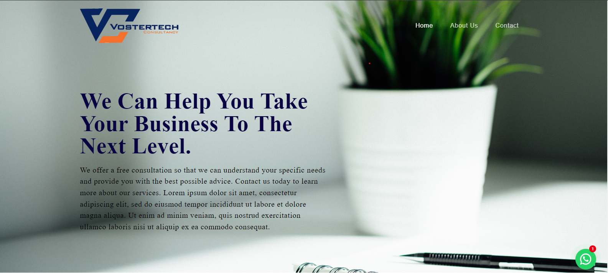

<h1 align="center">Vostertech Consultancy</h1>
<p>This is an official website for Vostertech  Consultancy. </p>
<hr />

<hr />
<h2> 🍿 Features </h2>
<ul>
<li>Responsive</li>
</ul>
<hr />
<h2> 🍿 Technologies </h2>
<ul>
<li>ReactJs</li>
<li>NodeJs</li>
<li>HTML</li>
<li>CSS</li>
<li>Bootstrap</li>
<li>React bootstrap</li>
<li>Material UI</li>
<li>Tailwind CSS</li>
</ul>
<hr />
<h2> 🍿 How to Run the Website on Your System </h2>
<h3> Step 1: Download and Extract the Code </h3>
<p>First, download the entire website code and extract the ZIP file to a folder on your local system.</p>
<h4>Website Code: https://github.com/tchaipa/vostertech</h4>
<h3>Step 2: Run the Website
</h3>
<p>Open your code editor (such as VS Code) and navigate to the project directory. Then, open a terminal and run the following command:
pnpm run dev</p>
<p>This will start the application. Open a web browser and navigate to <a href="http://localhost:3000">http://localhost:3000</a> to access the website.</p>  
  
```bash
 npm start
 ```
<hr />
<h2> 🍿 Demo </h2>
<p> - Check out our live demo at https://vostertech.co.zw </p>
#